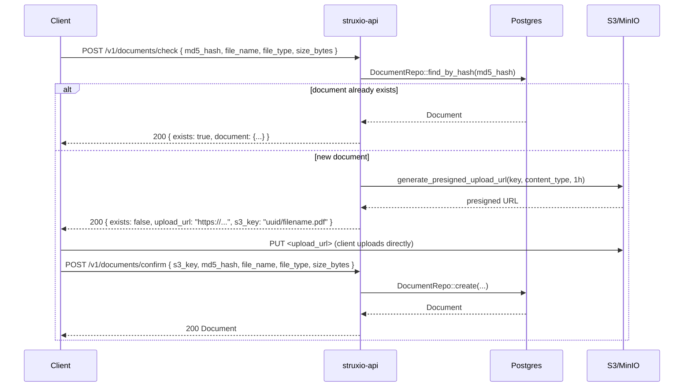
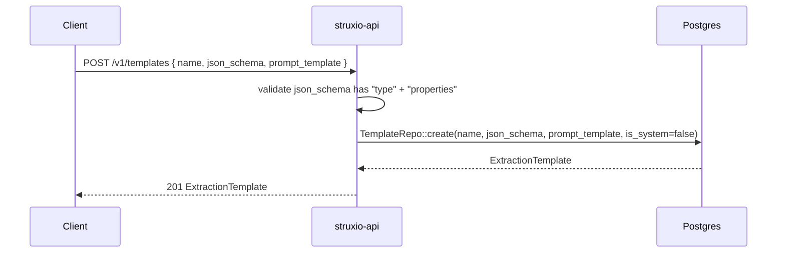
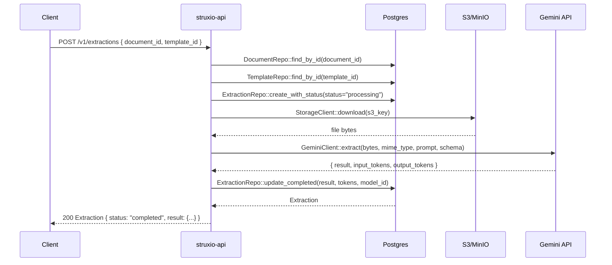
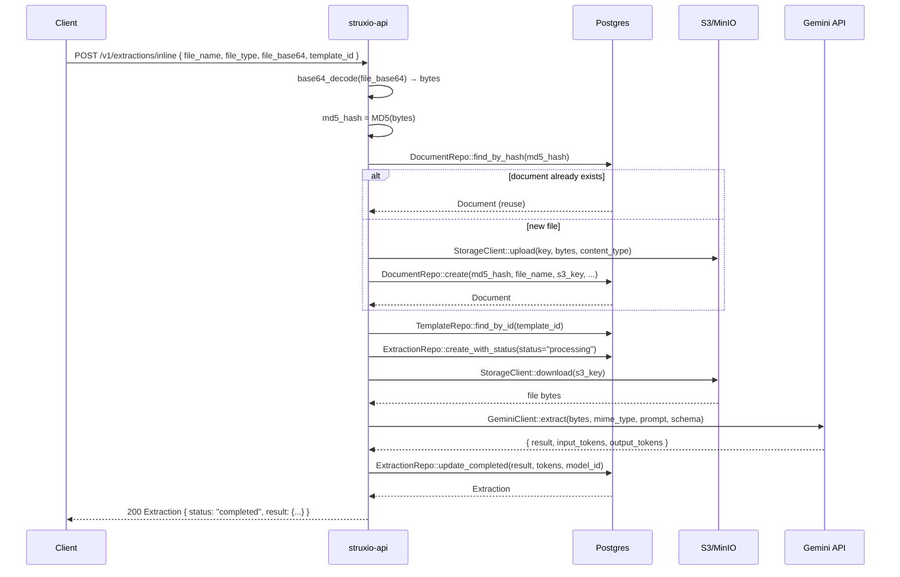
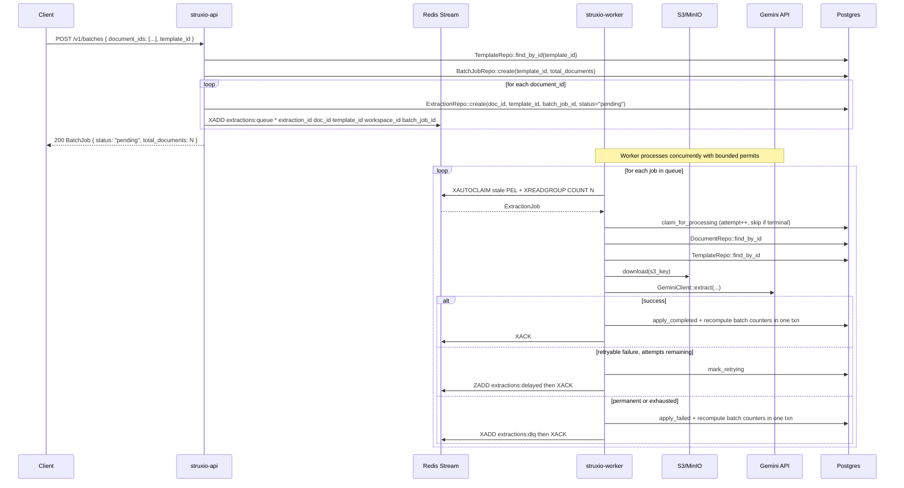

# Struxio Architecture

A self-hostable document extraction API. You upload documents, define JSON schemas for what you want to extract, and Gemini AI does the rest — synchronously or asynchronously via a job queue.

---

## Crate Structure

```
struxio/
├── crates/
│   ├── common/     ← shared models, AppError, Config
│   ├── db/         ← SQLx repository layer (raw DB queries)
│   ├── core/       ← business logic, services, queue traits, storage, Gemini
│   ├── api/        ← Axum HTTP server, routes, auth middleware
│   └── worker/     ← background job processor binary
├── migrations/     ← Postgres schema
└── docker-compose.yml
```

### Dependency flow

```
common → db → core → api
                   ↘ worker
```

`api` and `worker` are the only binaries. Everything else is a library crate.

---

## Schema

| Table | Purpose |
|---|---|
| `documents` | Uploaded files (stored in S3/MinIO) |
| `extraction_templates` | Reusable JSON schemas + Gemini prompt templates |
| `extractions` | Individual extraction jobs with status and result |
| `batch_jobs` | A batch run that fans out to many extractions |
| `ai_models` | AI model registry with pricing metadata |

---

## Full Request Flow by Endpoint

### 1 — Document Upload (two-step)

Documents are never uploaded through the API server. Instead, the client gets a pre-signed S3 URL and uploads directly to storage.

```
POST /v1/documents/check
POST /v1/documents/confirm
```



**How to call:**
```bash
# Step 1 — check / get upload URL
curl -X POST http://localhost:8080/v1/documents/check \
  -H "Authorization: Bearer $STRUXIO_API_KEY" \
  -H "Content-Type: application/json" \
  -d '{"md5_hash":"abc123","file_name":"invoice.pdf","file_type":"pdf","size_bytes":204800}'

# Step 2 — upload directly to S3 using the returned upload_url
curl -X PUT "<upload_url>" \
  -H "Content-Type: application/pdf" \
  --data-binary @invoice.pdf

# Step 3 — confirm the upload
curl -X POST http://localhost:8080/v1/documents/confirm \
  -H "Authorization: Bearer $STRUXIO_API_KEY" \
  -H "Content-Type: application/json" \
  -d '{"s3_key":"<s3_key>","md5_hash":"abc123","file_name":"invoice.pdf","file_type":"pdf","size_bytes":204800}'
```

---

### 2 — Templates

Templates define **what** to extract: a Gemini prompt + a JSON schema for the response shape.

```
GET    /v1/templates
POST   /v1/templates
GET    /v1/templates/{id}
PUT    /v1/templates/{id}
DELETE /v1/templates/{id}
```



**How to call:**
```bash
# Create a template
curl -X POST http://localhost:8080/v1/templates \
  -H "Authorization: Bearer $STRUXIO_API_KEY" \
  -H "Content-Type: application/json" \
  -d '{
    "name": "Invoice",
    "description": "Extract invoice data",
    "prompt_template": "Extract all invoice data from this document.",
    "json_schema": {
      "type": "object",
      "properties": {
        "vendor_name": { "type": "string" },
        "total": { "type": "number" },
        "invoice_number": { "type": "string" }
      }
    }
  }'

# List all templates (includes system templates)
curl http://localhost:8080/v1/templates \
  -H "Authorization: Bearer $STRUXIO_API_KEY"

# Get / update / delete by ID
curl http://localhost:8080/v1/templates/<id> \
  -H "Authorization: Bearer $STRUXIO_API_KEY"
```

---

### 3 — Single Extraction (synchronous)

Runs extraction immediately, calls Gemini, and returns the result in the response.

```
POST /v1/extractions
GET  /v1/extractions
GET  /v1/extractions/{id}
```



**How to call:**
```bash
# Run a synchronous extraction
curl -X POST http://localhost:8080/v1/extractions \
  -H "Authorization: Bearer $STRUXIO_API_KEY" \
  -H "Content-Type: application/json" \
  -d '{"document_id":"<doc-uuid>","template_id":"<template-uuid>"}'

# List all extractions
curl http://localhost:8080/v1/extractions \
  -H "Authorization: Bearer $STRUXIO_API_KEY"

# Get a specific extraction
curl http://localhost:8080/v1/extractions/<id> \
  -H "Authorization: Bearer $STRUXIO_API_KEY"
```

---

### 3b — Inline Extraction (one-shot, base64 body)

Send a file directly in the request body — no upload step required. The server decodes the base64, deduplicates by MD5, stores the file in S3 if it hasn't been seen before, and returns the extraction result synchronously.

```
POST /v1/extractions/inline
```



**How to call:**
```bash
# Encode file to base64
B64=$(base64 -i invoice.pdf)   # macOS / Linux

# One-shot extraction — no upload step needed
curl -X POST http://localhost:8080/v1/extractions/inline \
  -H "Authorization: Bearer $STRUXIO_API_KEY" \
  -H "Content-Type: application/json" \
  -d "{
    \"file_name\": \"invoice.pdf\",
    \"file_type\": \"pdf\",
    \"file_base64\": \"$B64\",
    \"template_id\": \"<template-uuid>\"
  }"
```

> **Inline vs. two-step upload:** use inline for quick scripts or one-off calls; use the two-step flow for large files or when you need the document ID before extraction.

---

### 4 — Batch Extraction (asynchronous)

Runs many documents through a template in parallel via a Redis Streams job queue. The API returns immediately; the worker processes jobs in the background.

```
POST /v1/batches
GET  /v1/batches
GET  /v1/batches/{id}
GET  /v1/batches/{id}/extractions
```



**How to call:**
```bash
# Start a batch
curl -X POST http://localhost:8080/v1/batches \
  -H "Authorization: Bearer $STRUXIO_API_KEY" \
  -H "Content-Type: application/json" \
  -d '{"document_ids":["<uuid1>","<uuid2>","<uuid3>"],"template_id":"<template-uuid>"}'

# Poll batch status
curl http://localhost:8080/v1/batches/<batch-id> \
  -H "Authorization: Bearer $STRUXIO_API_KEY"

# Get all extractions for a batch
curl http://localhost:8080/v1/batches/<batch-id>/extractions \
  -H "Authorization: Bearer $STRUXIO_API_KEY"
```

---

## Queue Architecture

The extraction job queue is abstracted behind a thin producer/consumer pair in `struxio-core::queue`. Delivery policy (retryability, backoff, batch terminal states) lives in `struxio-core::jobs` and is unit-tested without Redis or Postgres.

```rust
trait QueueProducer { async fn enqueue_extraction(...) }
trait QueueConsumer  { async fn next_job(...) → Option<ExtractionJob> }
```

`RedisProducer` / `RedisConsumer` use Redis Streams with a consumer group. Guarantees:

- **At-least-once delivery.** ACK happens only after a durable success, a durable retry (`retrying` + delayed ZSET), or a durable dead-letter (`failed` + `extractions:dlq`).
- **Concurrent consumers.** `XREADGROUP COUNT N` plus a bounded semaphore; stale PEL entries are reclaimed with `XAUTOCLAIM`.
- **Idempotent terminal state.** Completing or failing an already-terminal extraction is a no-op and does not bump batch counters.
- **Honest batch status.** Counters are recomputed from child rows inside the same transaction as the terminal write: `completed`, `partially_completed`, or `failed` only when no child is pending, processing, or retrying.

Workspace identity is a required stream field. Malformed or nil-workspace entries are dead-lettered and ACKed, never executed.

---

## Authentication

Every endpoint requires `Authorization: Bearer <STRUXIO_API_KEY>`.

The key is validated in the `static_auth` Axum middleware via `FromRequestParts`. On success, it injects an `AuthUser` marker into the request — a unit struct that proves authentication with no identity fields.

```bash
export STRUXIO_API_KEY=your-api-key

curl http://localhost:8080/v1/documents \
  -H "Authorization: Bearer $STRUXIO_API_KEY"
```

---

## Running Locally

```bash
# Start infrastructure
docker compose up -d

# Copy and fill in env vars
cp .env.example .env

# Apply migrations
sqlx migrate run

# Start the API server (port 8080)
cargo run -p struxio-api

# Start the worker (separate terminal — needed for batch jobs)
cargo run -p struxio-worker
```

| Service | Port | Purpose |
|---|---|---|
| struxio-api | 8080 | HTTP API |
| Postgres | 5432 | Primary datastore |
| Redis | 6379 | Job queue (Redis Streams) |
| MinIO | 9000 | S3-compatible document store |
| MinIO console | 9001 | Browser UI for MinIO |
